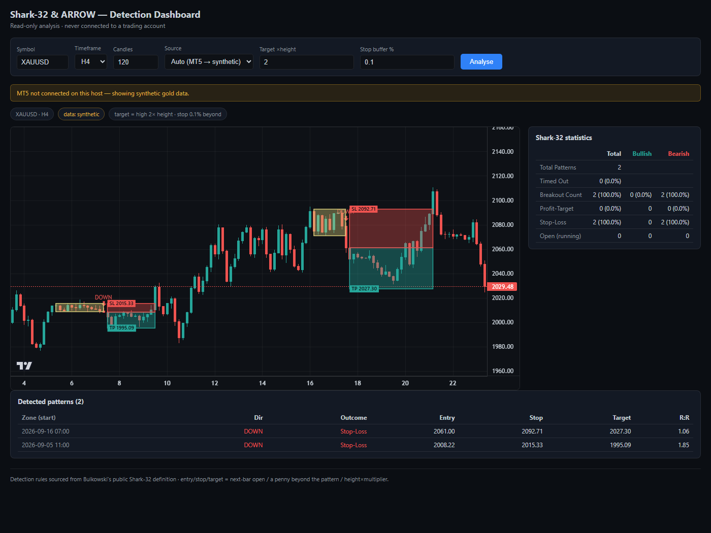
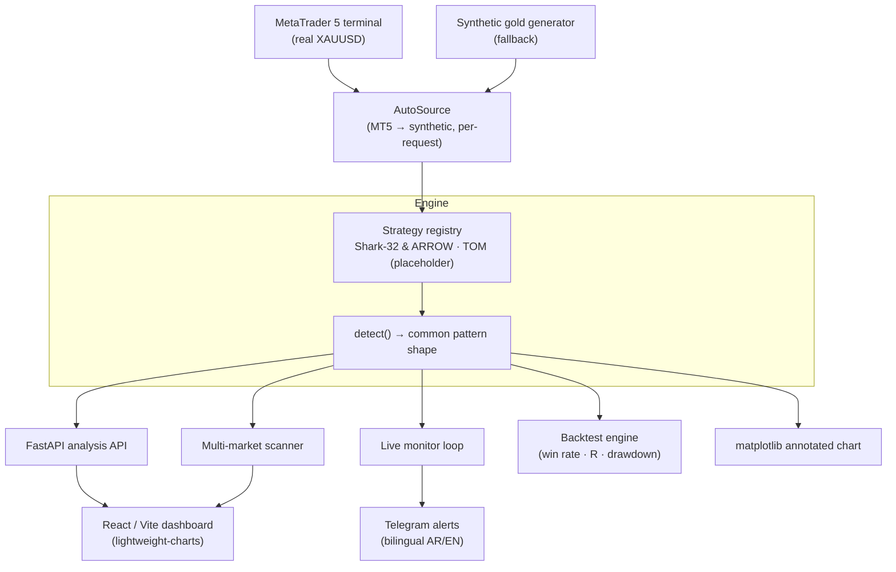

# Shark-32 & ARROW — Trading-Signal Detection System

> A **read-only** pattern-detection and alerting engine for gold (XAUUSD). It finds
> *Shark-32* candlestick compression patterns, confirms *ARROW* breakouts, computes
> entry / stop-loss / take-profit from published rules, backtests them, and pushes
> **Telegram alerts** the moment a setup fires — **without ever connecting to a
> trading account or placing an order.**



*Live dashboard: candlestick chart with detected compression zones, breakout
arrows, entry/stop/target overlays, an outcome-statistics panel, and a
detected-patterns table.*

---

## The problem

A discretionary gold trader was manually flipping through charts looking for one
specific setup — a three-candle "compression" that then breaks out — and wanted to
be **alerted** when it appeared instead of watching screens all day. The hard
constraints:

- **Alerts only, never auto-execution.** The system must say *"enter buy here /
  enter sell here"* and stop. The human trades. No brokerage keys, no orders.
- **Adjustable without touching code.** Every threshold had to live in config so
  the trader could tune sensitivity themselves.
- **Extensible to more strategies later** without rewriting the engine.
- **Grounded, not guessed.** The detection rules had to trace back to a published,
  verifiable definition — not a heuristic someone made up.

## What it does

| Capability | Detail |
|---|---|
| **Pattern detection** | Shark-32 three-candle telescoping compression zone + ARROW close-through breakout confirmation. |
| **Trade levels** | Entry (next-bar open), stop (buffer beyond the zone), target (Bulkowski's *measure rule*: zone edge ± 2× zone height) — all sourced, not invented. |
| **Interactive dashboard** | React + TradingView charts; tune symbol, timeframe, candle count, target multiple, and stop buffer live and re-analyse. |
| **Backtesting** | Win rate, average R-multiple, and max drawdown over the history. |
| **Multi-market scanner** | Runs the strategy across many symbols × timeframes and returns *only* the ones where a setup is forming or firing, with RSI/ATR/volume filters. |
| **Live monitor + Telegram** | Polls the feed, detects on closed bars, and pushes a bilingual (Arabic / English) alert the instant a fresh signal appears. |
| **Real + synthetic data** | Pulls real XAUUSD from a MetaTrader 5 terminal, and transparently falls back to a synthetic gold generator when MT5 isn't reachable. |

## Architecture

The core design idea: **every layer depends only on the abstraction below it.** A
strategy doesn't know where candles came from; a backtest doesn't know how a signal
was generated; the dashboard doesn't know which strategy produced a pattern. That's
what turns *"swap the data feed"* and *"add a second strategy"* into additions
rather than rewrites.



```
config/shark32.yaml      →  every threshold in one file, no code changes to tune
src/data/                →  pluggable feed: MT5 · synthetic · AutoSource fallback
src/strategy/            →  one folder per strategy behind a shared interface
  └ shark32/             →  zone detection + ARROW confirmation + signal levels
  └ tom/                 →  registered placeholder (awaiting rules) — proves the seam
src/backtest/            →  win rate / R-multiple / drawdown
src/scanner/             →  symbols × timeframes → only what passes the filters
src/monitor/ + notify/   →  live watch loop → Telegram push
src/api/                 →  FastAPI read-only analysis + scan endpoints
frontend/                →  React dashboard (chart, stats, table, filters)
```

## Correctness — validated against the published reference

The detector isn't just "looks about right." It's checked against the worked
example in Bulkowski's public Shark-32 definition: feed in his candles, and the
engine must reproduce his compression zone (blue box), his breakout point (▲), and
his measure-rule target — to the cent.


*The detector reproducing the reference example — zone height `1.46`, target
`136.99` — exactly matching the published source.*

A second correctness property matters even more for live trading: **no repainting.**
The newest candle from MT5 is still forming, and a breakout detected on it can
vanish before the bar closes. Detection runs on **closed bars only**, everywhere —
so the dashboard, the scanner, and the Telegram alert can never disagree about what
happened. New signals are de-duplicated through a persisted "already-alerted" set
that survives restarts, so a long-running watcher never spams the same setup twice.

## Tech stack

**Backend** · Python 3 · FastAPI · Uvicorn · pandas · NumPy · PyYAML
**Data** · MetaTrader 5 (live XAUUSD) · custom synthetic OHLC generator
**Frontend** · React 18 · Vite · TradingView `lightweight-charts`
**Alerts** · Telegram Bot API (stdlib `urllib` — zero added dependencies)
**Viz** · matplotlib (annotated-chart deliverable)
**Config** · YAML-driven parameters (no code edits to retune)

## Engineering decisions I'm proud of

- **Graceful degradation, per request.** Each API request gets its own feed object,
  so a momentary MT5 outage degrades *that one request* to synthetic data —
  clearly labelled in the UI — instead of pinning the whole server into a bad state.
- **A strategy is a folder, not a fork.** Adding an algorithm is a new
  `TradingStrategy` subclass plus one line in the registry; the engine, API, and
  frontend render it unchanged because every strategy emits the same pattern shape.
  The `TOM` placeholder is committed *specifically* to prove that seam holds.
- **The scanner never lies.** Every number in a result row was computed by the
  engine from candles — it selects and ranks, it never estimates. One dead symbol
  is isolated and reported, never allowed to take down the scan cycle.
- **Honest scope by construction.** There is no order-placement code path to
  misconfigure. The system reads market data and sends messages — that's the whole
  surface area.

## Running it

```bash
# 1. One-shot backtest + annotated chart (synthetic data, no setup required)
pip install -r requirements.txt
python run_prototype.py            # → output/prototype_chart.png + console report

# 2. Analysis API
pip install -r requirements-api.txt
uvicorn src.api.server:app --reload --port 8000

# 3. Dashboard
cd frontend && npm install && npm run dev
```

On a Windows host with a logged-in MetaTrader 5 terminal, the feed auto-upgrades
from synthetic to **real XAUUSD** with no config change. Everywhere else it runs on
the synthetic generator so the whole thing is demoable on any machine.

## Scope & honesty

Two things are deliberately labelled rather than hidden:

- **Synthetic vs. real data** is called out on every screen. The screenshots above
  run on the synthetic feed, which is why the dashboard banner says so — the point
  of the prototype is the *pipeline*, and the feed is a one-line swap.
- **The detection rules are sourced, the fit to the client's exact variant is
  not yet confirmed.** Zone shape, breakout, and entry/stop/target all trace to two
  independent published definitions of "Shark-32"; whether the client's private
  course teaches an identical or slightly-varied version is a validation step, not a
  code change.

---

*Role: sole engineer — architecture, detection algorithm, backtester, FastAPI
backend, React dashboard, multi-market scanner, and Telegram alerting.*
